### Basic Kubernetes (K8s) for Web Developer ออนไลน์
---
### ⚡ Day 1

- [ ] Section 1: การเตรียมเครื่องมือและบน Mac และ Windows
- [ ] Section 2: การพัฒนา Application The Twelve Factors
- [ ] Section 3: ทบทวนการใช้งาน Docker

##### 💾 ดาวน์โหลดเอกสารประกอบการเรียนรู้
📥 [Basic Kubernetes (K8s) for Web Developer](https://bit.ly/basic-k8s-online)

##### 🔨 Tools & Environment Setup
📥 [Docker Desktop](https://docs.docker.com/desktop/)
📥 [Visual Studio Code พร้อมส่วนเสริมที่จำเป็น](https://code.visualstudio.com/download)
📥 [Git](https://git-scm.com/downloads)
📥 [LENS IDE](https://k8slens.dev/)

#### 📚 Section 1: การเตรียมเครื่องมือและบน Mac และ Windows
##### 💻 ตรวจสอบเวอร์ชั่นของแต่ละเครื่องมือ
ตรวจสอบเวอร์ชั่นของ Docker
```bash
docker --version
```

ตรวจสอบเวอร์ชั่นของ Kubernetes
```bash
kubectl version
```

ตรวจสอบสถานะของ Kubernetes
```bash
kubectl cluster-info
kubectl get nodes
kubectl get pods --all-namespaces
```

ตรวจสอบเวอร์ชั่นของ Visual Studio Code
```bash
code --version
```

ตรวจสอบเวอร์ชั่นของ Git
```bash
git version
```

ตรวจสอบเวอร์ชั่นของ Lens IDE
```bash
lens version
```

แนะนำรายชื่อส่วนเสริมของ Visual Studio Code for docker และ Kubernetes

- AutoFileName
- Material Icon Theme
- Docker
- Kubernetes
- GitHub Pull Requests and Issues
- One Dark Pro

#### 📚 Section 2: การพัฒนา Application แบบ The Twelve Factors
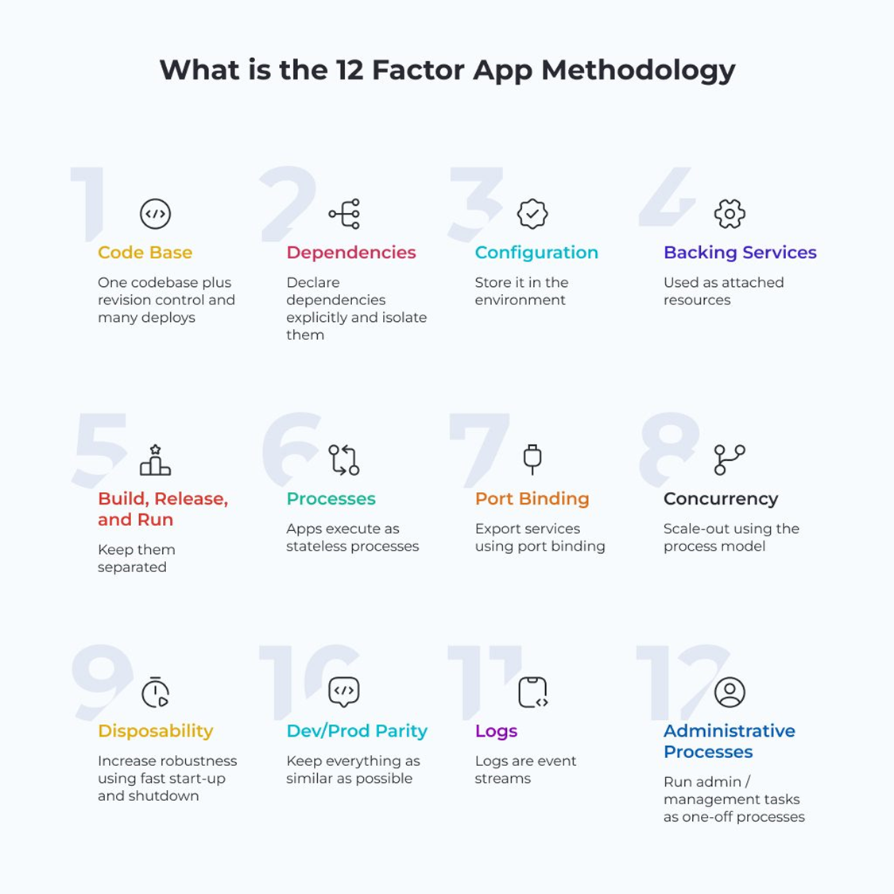
Quote จาก [The Twelve-Factor App](https://12factor.net/)
> The Twelve-Factor App เป็นแนวทางปฏิบัติที่ออกแบบมาเพื่อช่วยในการพัฒนาและบริหารจัดการแอปพลิเคชันในสภาพแวดล้อมคลาวด์ โดยเฉพาะการพัฒนาแบบ SaaS (Software as a Service) แนวทางนี้เน้นการจัดการโค้ด การตั้งค่า การเก็บข้อมูล และการปรับสเกลของแอปเพื่อให้สามารถทำงานในสภาพแวดล้อมที่ซับซ้อนและปรับขยายได้อย่างมีประสิทธิภาพ
> 1. Codebase (ฐานโค้ด)
แอปพลิเคชันต้องมีฐานโค้ดเดียว แต่สามารถปรับใช้ (deploy) ได้หลายเวอร์ชัน เช่น development, staging, production โดยแต่ละเวอร์ชันใช้ฐานโค้ดเดียวกันแต่แตกต่างใน configuration
> 2. Dependencies (การจัดการ dependencies)
แอปต้องประกาศ dependencies ทั้งหมดที่จำเป็นในไฟล์ manifest (เช่น package.json สำหรับ Node.js) และจัดการโดยแยกออกจากระบบ (system-wide dependencies)
> 3. Configurations (การตั้งค่า)
การตั้งค่าควรแยกออกจากโค้ด โดยใช้ environment variables (เช่น keys, URLs) เพื่อให้การตั้งค่าต่างๆ เปลี่ยนแปลงได้ง่ายสำหรับการ deploy แต่ละ environment
> 4. Backing services (บริการสำรอง)
ทุกบริการที่แอปพึ่งพาควรถูกมองว่าเป็น resource ที่แนบง่าย เช่น databases, message queues หรือ external services โดยสามารถเปลี่ยนบริการสำรองได้โดยไม่ต้องแก้โค้ด
> 5. Build, release, run (การสร้าง, การปล่อย, การทำงาน)
แอปพลิเคชันควรมีขั้นตอนชัดเจนในการ build (เตรียมโค้ด), release (รวมโค้ดและการตั้งค่า), และ run (การทำงานจริง) เพื่อแยกการจัดการในแต่ละขั้นตอนออกจากกัน
> 6. Processes (กระบวนการ)
แอปพลิเคชันควรประกอบด้วย process ที่ไม่เก็บสถานะ (stateless) โดยการเก็บข้อมูลควรถูกแยกไปยังฐานข้อมูลหรือบริการอื่น
> 7. Port binding (การผูกพอร์ต)
แอปควรกำหนดการเชื่อมต่อผ่าน port binding โดยใช้ HTTP server ของตัวเอง เช่นการรันแอป Node.js ที่ binding ไปที่พอร์ต 3000
> 8. Concurrency (การประสานงาน)
แอปต้องสามารถทำงานหลายกระบวนการได้พร้อมกัน โดยแยกการทำงานที่แตกต่างออกเป็น process ย่อยๆ เพื่อให้สามารถปรับขนาดได้ง่าย
> 9. Disposability (ความสามารถในการทำลาย)
Process ควรสามารถหยุดหรือเริ่มใหม่ได้ง่ายและรวดเร็ว โดยไม่ทำให้แอปทำงานล้มเหลว
> 10. Dev/prod parity (ความเท่าเทียมระหว่างการพัฒนาและการใช้งาน)
สภาพแวดล้อมของการพัฒนา, staging, และ production ควรมีความสอดคล้องกันมากที่สุด เพื่อป้องกันปัญหาที่เกิดจากความแตกต่างของสภาพแวดล้อม
> 11. Logs (การบันทึกข้อมูล)
แอปพลิเคชันไม่ควรจัดการ logs โดยตรง แต่ควรส่งออก logs เป็น event stream เพื่อให้บริการอื่นๆ จัดการ
> 12. Admin processes (กระบวนการของผู้ดูแลระบบ)
คำสั่งบริหารจัดการชั่วคราว (เช่น migration หรือ cron jobs) ควรแยกออกจาก codebase หลัก และสามารถรันได้ในสภาพแวดล้อมที่มีการ deploy แอป

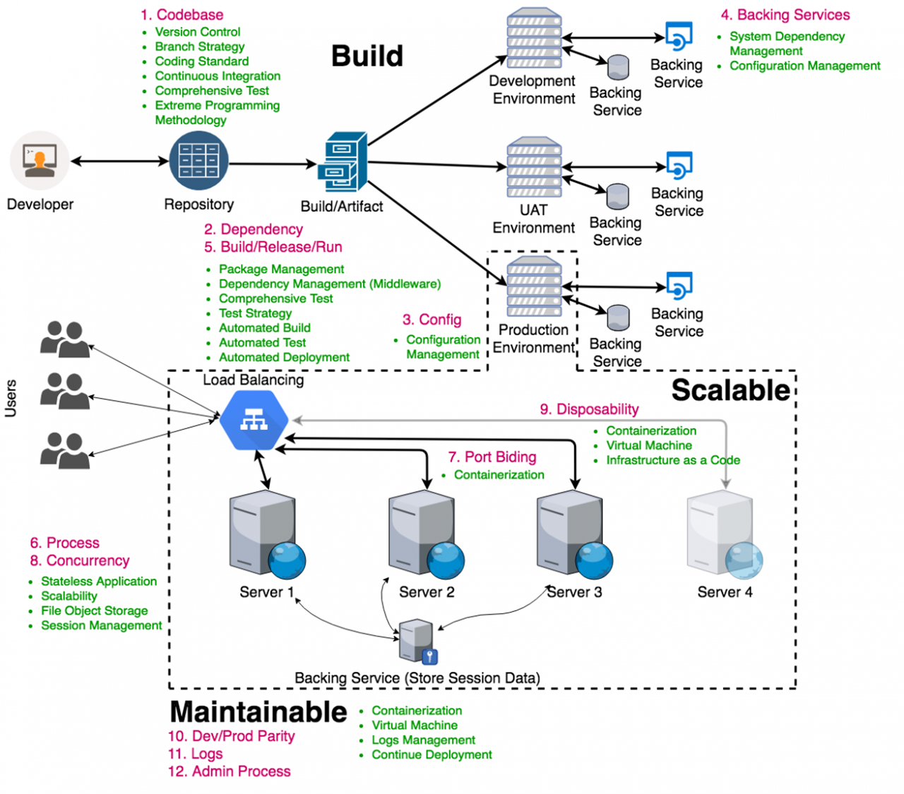

#### 📚 ทบทวนการใช้งาน Docker

##### What is Docker?

Docker คือ Software Container ถูกออกแบบมาเพื่อสร้างสภาพแวดล้อม
ให้ Application ของเราทำงานร่วมกันได้บน OS เดียวกัน ช่วยให้การ Setup และจัดการ Application ต่าง ๆ ทำได้ง่ายขึ้น

##### What is Container?

เปรียบเสมือนการ Pack รวม
App/Bins/Libs ต่างๆ เป็นก้อนเดียวกัน แล้วทำการกำหนดสภาพแวด
ล้อมการทำงานไว้ภายในตัวมันเอง

เมื่อต้องการนำไปใช้งานที่อื่นหรือบน
Production จริง ก็นำไปทั้งก้อน Container นี้เลย ทำให้สภาพแวดล้อมเหมือนกันทุกประการ

##### ทำไมต้องใช้ Docker และ Containers

- สามารถทำงานได้บน OS ใด ๆ ไม่ว่าจะเป็น Windows, Mac, Linux
- สามารถทำงานได้บน Cloud หรือ On-Premise
- สามารถทำงานได้บน Server หรือ Desktop
- สามารถทำงานได้บน VM หรือ Bare Metal
- สามารถทำงานได้บน Kubernetes, Swarm, Mesos, ECS, EKS, AKS, GKE
- สามารถทำงานได้บน CI/CD หรือ GitOps
- สามารถทำงานได้บน Dev, Staging, Production
- สามารถทำงานได้บน หลาย ๆ ระบบพร้อมกัน

##### Docker Alternatives
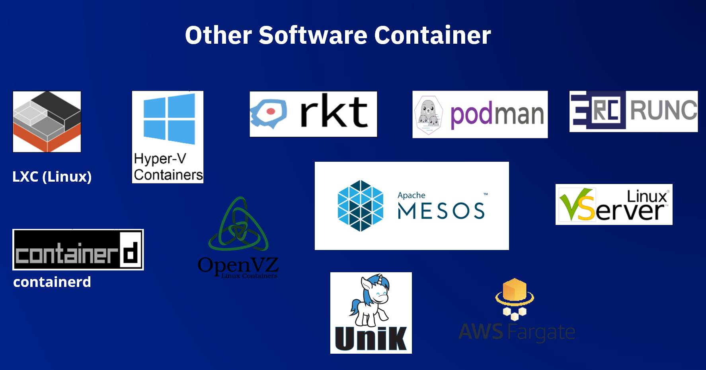
- Podman
- LXC
- LXD
- rkt
- CRI-O
- Kata Containers
- OpenVZ
- Virtuozzo
- Vagrant
- VMWare
- Hyper-V
- QEMU
- KVM

##### โครงสร้างและสถาปัตยกรรมของ Docker

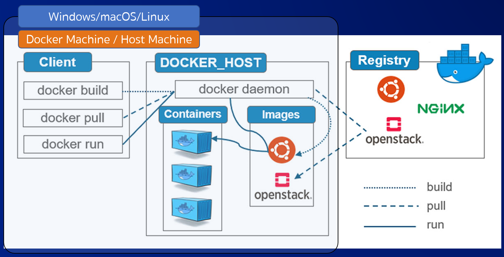

##### การใช้งาน Docker CLI

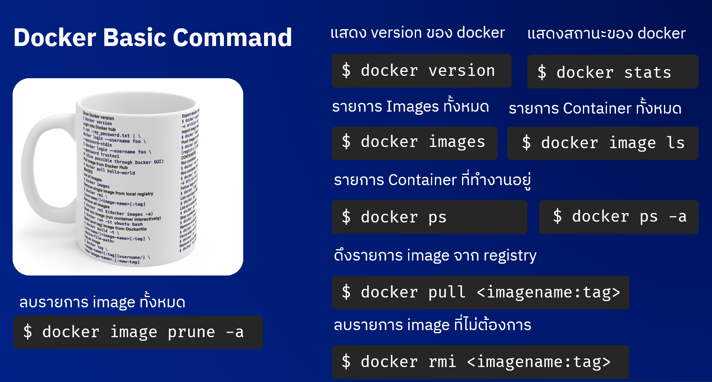

```bash
docker --version
docker info
docker run hello-world
docker ps
docker ps -a
docker images
docker pull nginx
docker run -d -p 8080:80 nginx
docker stop <container_id>
docker rm <container_id>
docker rmi <image_id>
docker exec -it <container_id> /bin/bash
docker logs <container_id>
docker inspect <container_id>
docker stats
docker system df
docker system prune
```
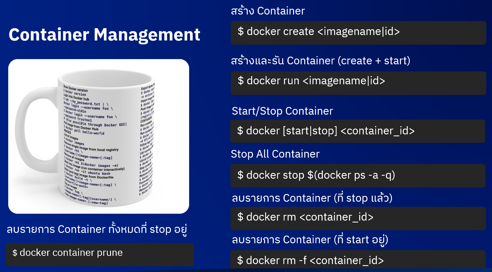

##### การใช้งาน CLI Container Management

สร้าง Container
```bash
docker run -d -p 8080:80 --name webserver nginx
```

เข้า Container
```bash
docker exec -it webserver /bin/bash
```

ลบ Container
```bash
docker rm -f webserver
```

##### Docker Container Lifecycle

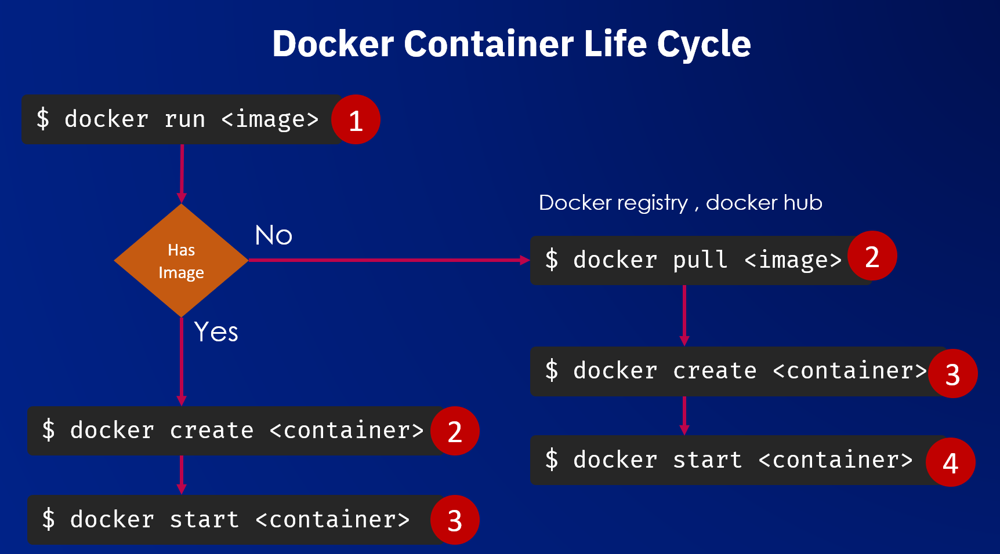

##### Docker Image

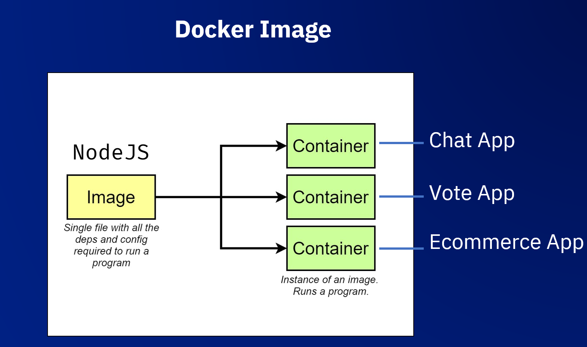
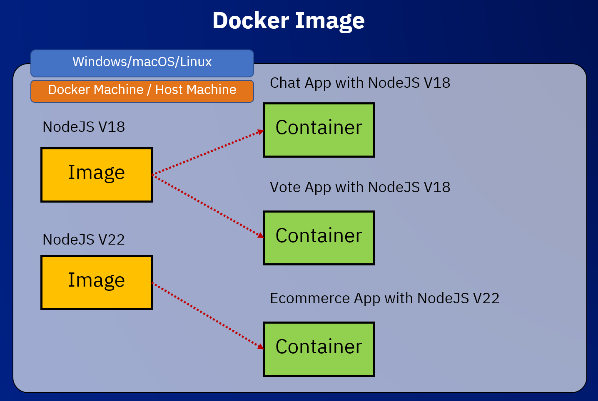

##### การทำ Port Mapping ของ Container

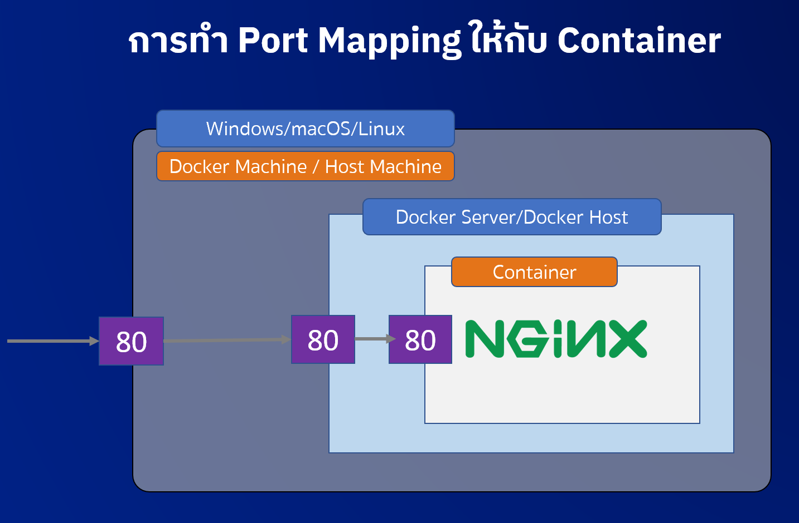

##### Docker Image Layers

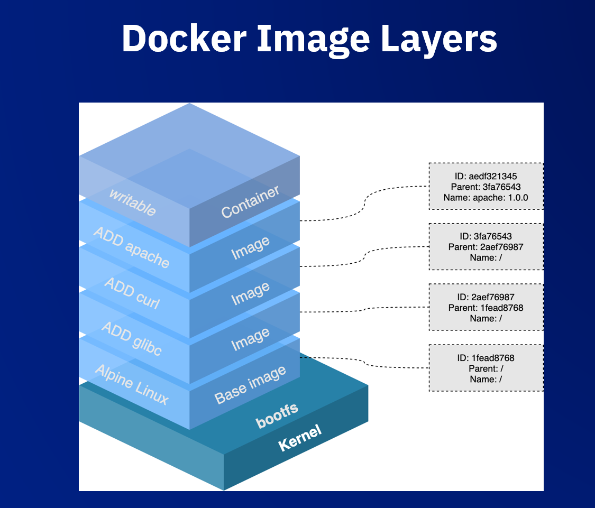

##### การใช้งาน Dockerfile

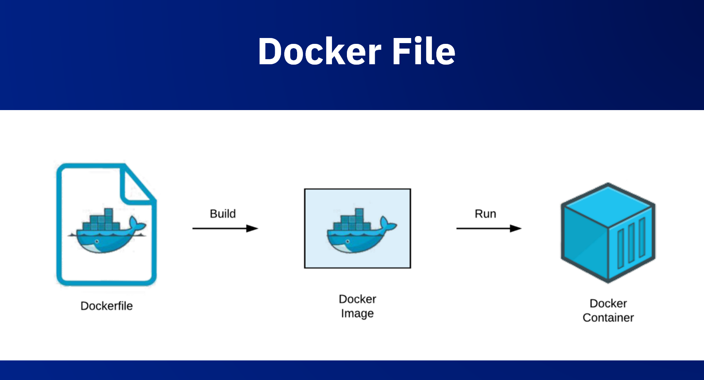

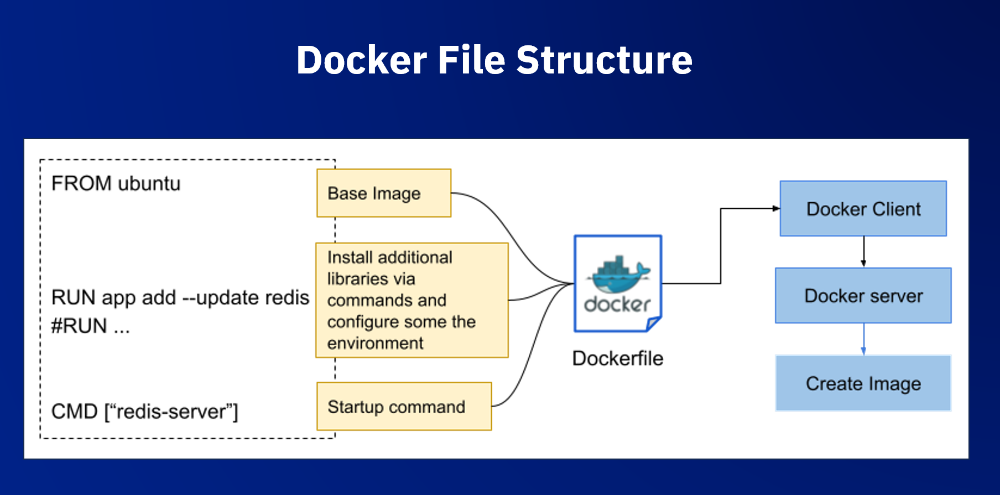

##### คำสั่งหลัก ๆ ของ Dockerfile

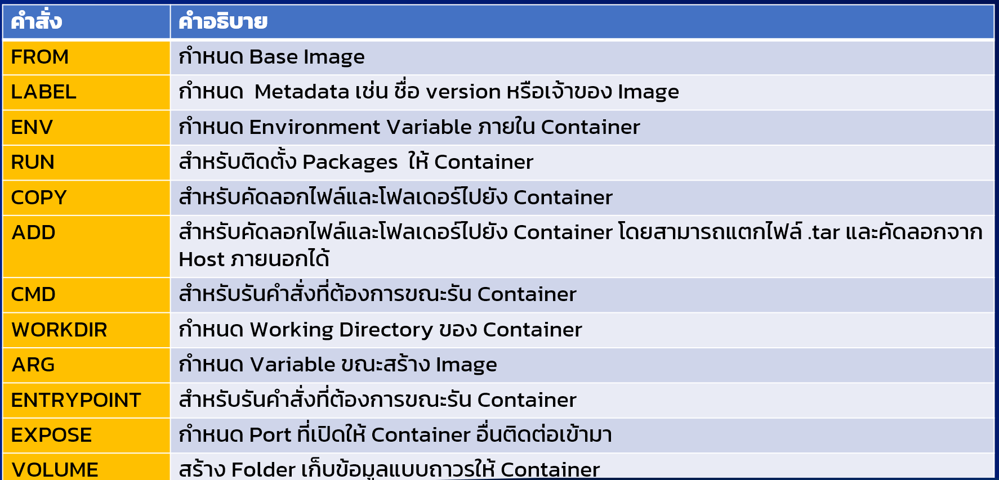

##### ตัวอย่างโปรเจค Node.js ที่ใช้ Dockerfile

```bash
mkdir my-node-app
cd my-node-app
npm init -y
npm install express
touch app.js
```

```javascript
const express = require('express');
const app = express();
const port = 3000;

app.get('/', (req, res) => {
  res.send('Hello World!');
});

app.listen(port, () => {
  console.log(`Example app listening at http://localhost:${port}`);
});
```

##### ตัวอย่าง Dockerfile สำหรับ Node.js Application

```Dockerfile
# Use the official image as a parent image
FROM node:18

# Set the working directory
WORKDIR /usr/src/app

# Copy package.json and package-lock.json to the working directory
COPY package*.json ./

# Install the dependencies
RUN npm install

# Copy the rest of the application
COPY . .

# Expose the port the app runs in
EXPOSE 3000

# Run the app
CMD ["node", "app.js"]
```

##### การ Build Docker Image จาก Dockerfile ด้วยคำสั่ง docker build ทำการ map port 3000 ของ Container ไปที่ port 3000 ของ Host

```bash
docker build -t my-node-app:1.0 .
```
ฺBuild และ Tag Image ด้วยชื่อ my-node-app และเวอร์ชั่น 1.0 จาก Dockerfile ที่อยู่ใน Directory ปัจจุบัน

##### การทดสอบ Image ที่ Build ด้วยการสร้าง Container และทดสอบการทำงานของ Application

```bash
docker run -d -p 3000:3000 my-node-app:1.0
```

##### Docker Compose คืออะไร

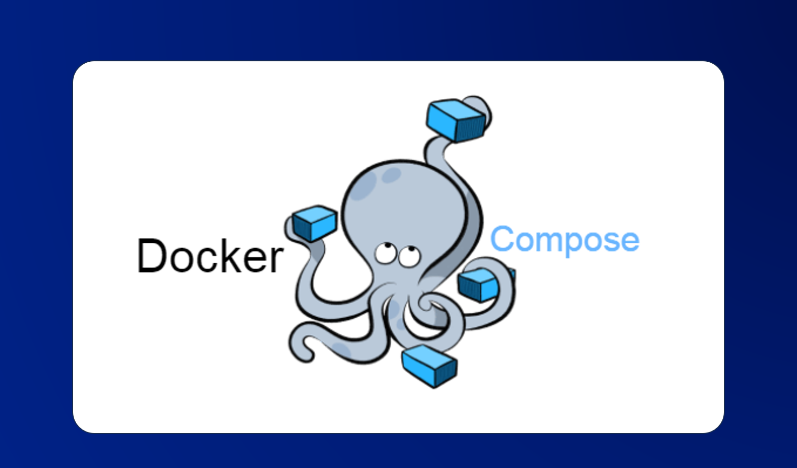

Docker Compose คือเครื่องมือที่ช่วยในการจัดการและสร้าง Container หลาย ๆ ตัวพร้อมกัน โดยใช้ไฟล์ YAML ที่เรียกว่า docker-compose.yml

##### การใช้งาน Docker Compose

```yaml
version: '3'

networks:
  my-network:
    driver: bridge

services:
  web:
    build: .
    ports:
        - "3000:3000"
    networks:
        - my-network
```

คำสั่งสำหรับการใช้งาน Docker Compose
```bash
docker-compose up -d
```

##### การใช้งาน Docker Compose สำหรับ NGINX Web Server

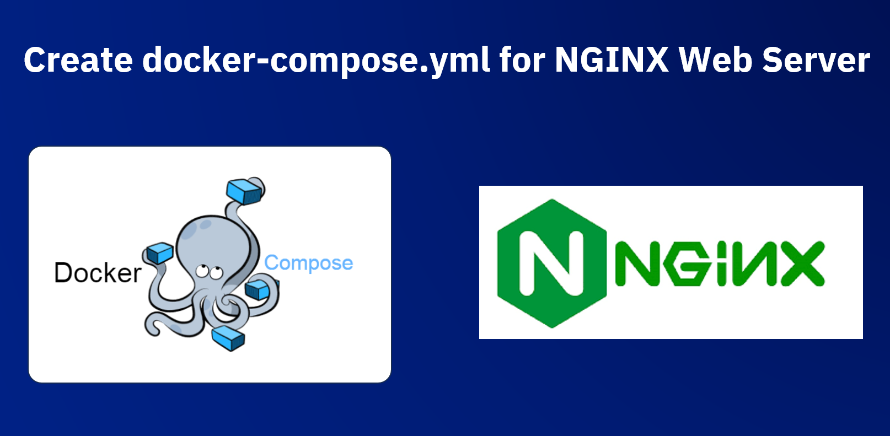

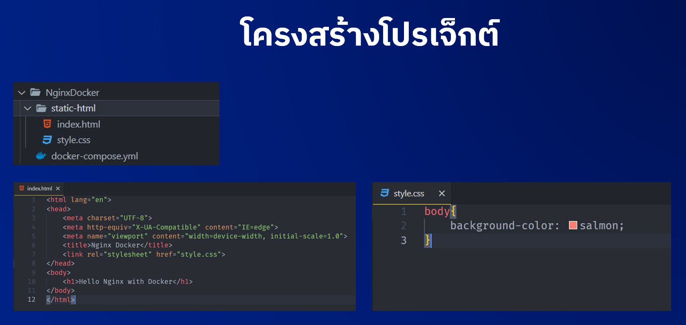

```yaml
networks:
  nginx_network:
    name: nginx_network
    driver: bridge

services:
  nginx:
    container_name: nginx
    image: nginx:stable-alpine
    volumes:
      - ./static-html:/usr/share/nginx/html
    ports:
      - "82:80"
    networks:
      - nginx_network
```

##### การใช้งาน Docker Compose สำหรับ Apache Webserver

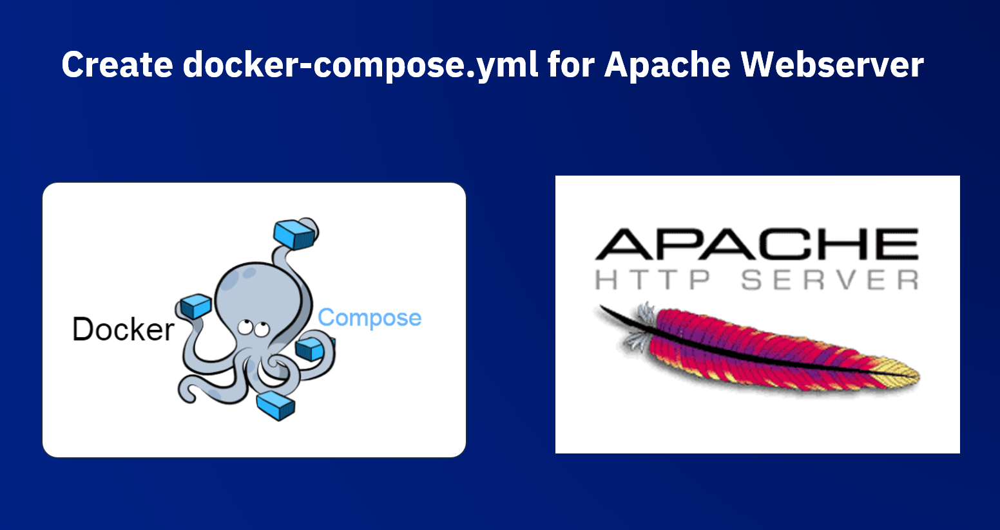

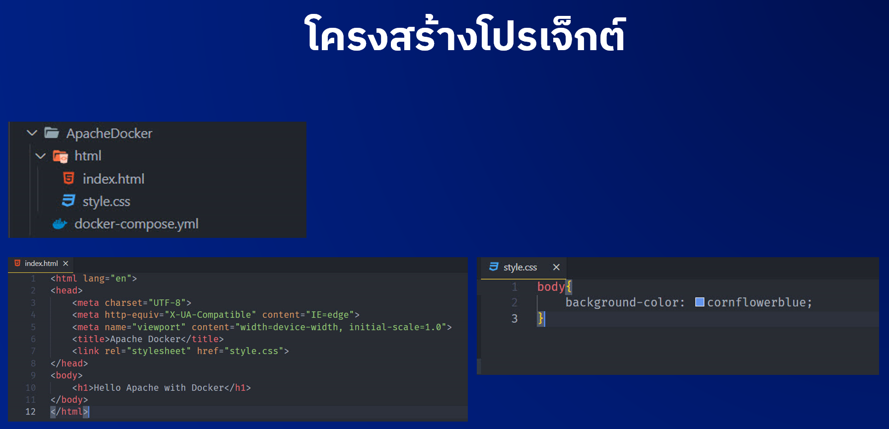

```yaml
networks:
  httpd_network:
    name: httpd_network
    driver: bridge

services:
  httpd:
    container_name: httpd
    image: httpd:2.4.41-alpine
    volumes:
      - ./html:/usr/local/apache2/htdocs/
    ports:
      - "81:80"
    networks:
      - httpd_network
```

### ⚡ Day 2

- [ ] Section 3: ทบทวนการใช้งาน Docker 
การใช้งาน Docker Compose สำหรับ LAMP Stack
- [ ] Section 4: พื้นฐานและภาพรวม Kubernetes

##### การใช้งาน Docker Compose สำหรับ LAMP Stack

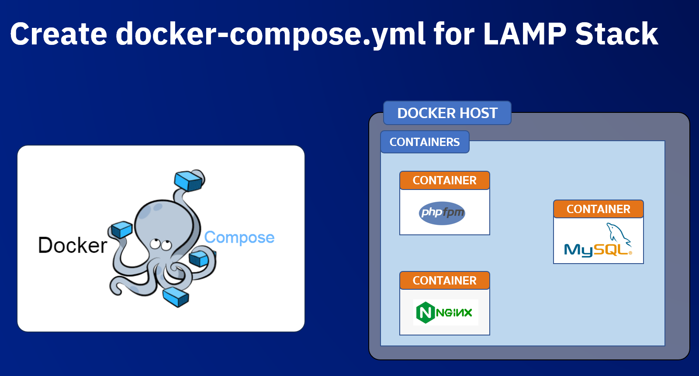

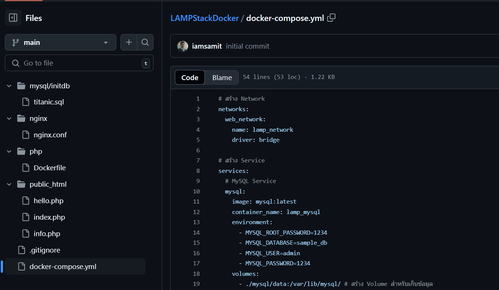

php/Dockerfile
```Dockerfile
# Base Image: php:8.3-fpm-alpine
FROM php:8.3-fpm-alpine

# Install Dependencies
RUN docker-php-ext-install pdo_mysql mysqli bcmath

# Set Working Directory
WORKDIR /var/www/html/

# Expose Port
EXPOSE 9000

```

nginx/nginx.conf
```nginx
server {
    listen 80;
    index index.php index.html;
    server_name localhost;
    root /var/www/html;
    location / {
        try_files $uri $uri/ /index.php?$query_string;
    }
    location ~ \.php$ {
        try_files $uri =404;
        fastcgi_split_path_info ^(.+\.php)(/.+)$;
        fastcgi_pass php:9000;
        fastcgi_index index.php;
        include fastcgi_params;
        fastcgi_param SCRIPT_FILENAME $document_root$fastcgi_script_name;
        fastcgi_param PATH_INFO $fastcgi_path_info;
    }
}

```

mysql/initdb/titanic.sql
```sql
SET SQL_MODE = "NO_AUTO_VALUE_ON_ZERO";
SET AUTOCOMMIT = 0;
START TRANSACTION;
SET time_zone = "+00:00";

CREATE TABLE `titanic` (
  `index` bigint(20) DEFAULT NULL,
  `PassengerId` bigint(20) DEFAULT NULL,
  `Survived` bigint(20) DEFAULT NULL,
  `Pclass` bigint(20) DEFAULT NULL,
  `Name` text,
  `Sex` text,
  `Age` double DEFAULT NULL,
  `SibSp` bigint(20) DEFAULT NULL,
  `Parch` bigint(20) DEFAULT NULL,
  `Ticket` text,
  `Fare` double DEFAULT NULL,
  `Cabin` text,
  `Embarked` text
) ENGINE=InnoDB DEFAULT CHARSET=latin1;

INSERT INTO `titanic` (`index`, `PassengerId`, `Survived`, `Pclass`, `Name`, `Sex`, `Age`, `SibSp`, `Parch`, `Ticket`, `Fare`, `Cabin`, `Embarked`) VALUES
(0, 1, 0, 3, 'Braund, Mr. Owen Harris', 'male', 22, 1, 0, 'A/5 21171', 7.25, NULL, 'S')

ALTER TABLE `titanic`
  ADD KEY `ix_titanic_index` (`index`);
COMMIT;
```

public_html/index.php

```php
<?php
// variable for connecting to the database
$host = "mysql";
$username = "admin";
$password = "1234";

// connect to the database
$connect = mysqli_connect($host, $username, $password);

// set the database
$db = mysqli_select_db($connect, "sample_db");

// check if the connection is successful
if ($connect) {
    // echo "Connection database and selected db successful";

    $sql = "SELECT * FROM titanic limit 10";
    $result = mysqli_query($connect, $sql);
    $data = array();
    while ($row = mysqli_fetch_assoc($result)) {
        // echo "<pre>";
        // print_r($row);
        // echo "</pre>";
        $data[] = $row;
    }

    header('Content-Type: application/json; charset=utf-8');
    echo json_encode($data);
    
} else {
    echo "Connection database failed!";
}
```

docker-compose.yml

```yaml
# สร้าง Network
networks:
  web_network:
    name: lamp_network
    driver: bridge

# สร้าง Service
services:
  # MySQL Service
  mysql:
    image: mysql:latest
    container_name: lamp_mysql
    environment:
      - MYSQL_ROOT_PASSWORD=1234
      - MYSQL_DATABASE=sample_db
      - MYSQL_USER=admin
      - MYSQL_PASSWORD=1234
    volumes:
      - ./mysql/data:/var/lib/mysql/ # สร้าง Volume สำหรับเก็บข้อมูล
      - ./mysql/initdb/:/docker-entrypoint-initdb.d/ # init script สำหรับสร้าง Table
    ports:
      - "4406:3306"
    networks:
      - web_network
    restart: always
  # PHP Service
  php:
    depends_on:
      - mysql
    build:
      context: ./php
      dockerfile: Dockerfile
    container_name: lamp_php
    volumes:
      - ./public_html/:/var/www/html/
    expose:
      - 9000
    networks:
      - web_network
    restart: always
  # Nginx Service
  nginx:
    depends_on:
      - php
    image: nginx:stable-alpine
    container_name: lamp_nginx
    volumes:
      - ./public_html/:/var/www/html/
      - ./nginx/nginx.conf:/etc/nginx/conf.d/default.conf:ro
    ports:
      - "8080:80"
    networks:
      - web_network
    restart: always
```

##### การใช้งาน Docker Compose สำหรับ MERN Stack

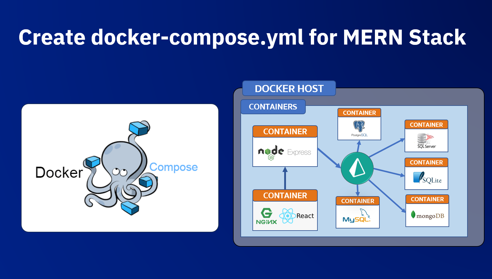

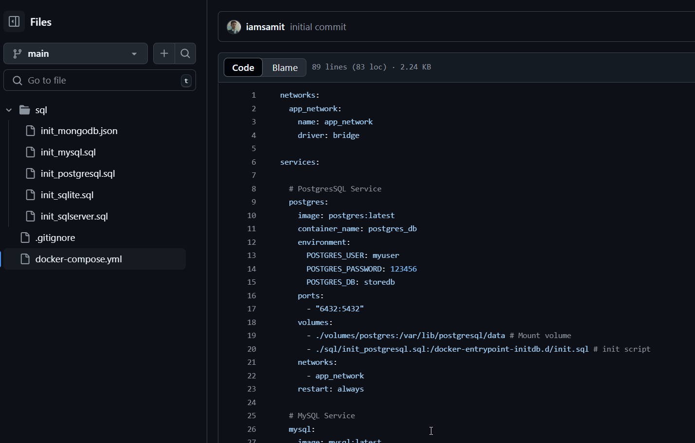

```yaml
networks:
  app_network:
    name: app_network
    driver: bridge

services:
  
  # PostgresSQL Service
  postgres:
    image: postgres:latest
    container_name: postgres_db
    environment:
      POSTGRES_USER: myuser
      POSTGRES_PASSWORD: 123456
      POSTGRES_DB: storedb
    ports:
      - "6432:5432"
    volumes:
      - ./volumes/postgres:/var/lib/postgresql/data # Mount volume
      - ./sql/init_postgresql.sql:/docker-entrypoint-initdb.d/init.sql # init script
    networks:
      - app_network
    restart: always
  
  # MySQL Service
  mysql:
    image: mysql:latest
    container_name: mysql_db
    environment:
      MYSQL_ROOT_PASSWORD: 123456
      MYSQL_DATABASE: storedb
      MYSQL_USER: myuser
      MYSQL_PASSWORD: 123456
    ports:
      - "5506:3306"
    volumes:
      - ./volumes/mysql:/var/lib/mysql  # Mount volume สำหรับ MySQL
      - ./sql/init_mysql.sql:/docker-entrypoint-initdb.d/init.sql
    networks:
      - app_network
    restart: always
  
  # SQLite Service
  sqlite:
    platform: linux/x86_64
    image: nouchka/sqlite3
    container_name: sqlite_db
    environment:
      DB_PATH: /data/sqlite/storedb.db
    volumes:
      - ./data:/data  # Mount volume สำหรับ SQLite
    command: tail -f /dev/null # Keep container running
    networks:
      - app_network
    restart: always

  # SQL Server Service (Azure SQL Edge)
  mssql:
    image: mcr.microsoft.com/azure-sql-edge:latest
    container_name: mssql_db
    environment:
      ACCEPT_EULA: Y
      MSSQL_SA_PASSWORD: "MyPassword@123"
      MSSQL_DATABASE: storedb
    ports:
      - "1533:1433"
    volumes:
      - ./volumes/mssql:/var/opt/mssql  # Mount volume สำหรับ SQL Server
      - ./sql/init_sqlserver.sql:/var/opt/mssql/init.sql
    networks:
      - app_network
    restart: always

  # MongoDB Service
  mongo:
    image: mongo:latest
    container_name: mongo_db
    environment:
      MONGO_INITDB_ROOT_USERNAME: myuser
      MONGO_INITDB_ROOT_PASSWORD: 123456
      MONGO_INITDB_DATABASE: storedb
    ports:
      - "37017:27017"
    volumes:
      - ./volumes/mongodb:/data/db  # Mount volume สำหรับ MongoDB
      - ./sql/init_mongodb.json:/docker-entrypoint-initdb.d/init.json
    networks:
      - app_network
    restart: always
```

##### การ Tag และ Push Image ไปยัง Docker Hub

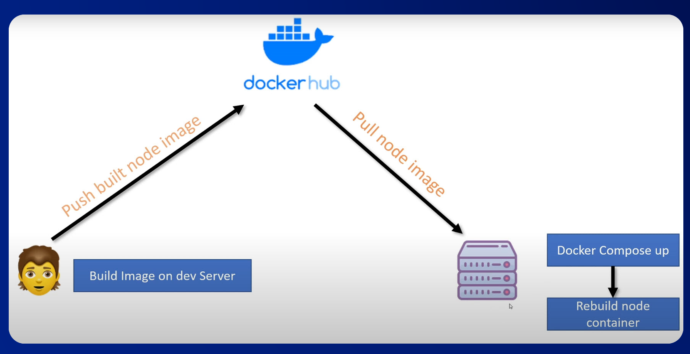

```bash
docker tag my-node-app:1.0 my-node-app:latest
docker logout
docker login
docker push my-node-app:latest
```

#### Section 4: พื้นฐานและภาพรวม Kubernetes

##### Kubernetes คืออะไร?

ต้นกำเนิดของ K8s นั้นเกิดมาจาก Pain ที่บริษัท Google เจอมาตลอด ในการพยายามจะจัดการ Data Center ของตัวเองมานานกว่า 15 ปี 

Kubernetes คือ container orchestration engine จุดประสงค์หลักของ kubernetes คือการจัดการ container deployments 

ในปัจจุบันทุกๆ application กำลังจะใช้ Microservices architecture มากกว่า Monolithic architecture และ วิธีการใช้งาน microservices architecture เหล่านั้นจะออกแบบโดย containerization technology manage containers at a large scale, คือเราใช้ kubernetes

##### จุดเด่นของ Kubernetes
Container Clustering :  สามารถทำ Configuration  เพื่อสั่งระบบให้ทำงานตามที่ต้องการโดยอัตโนมัติ (เรียกได้อีกแบบว่าเป็นการกำหนด Desired State)
Auto Scaling : รองรับการเพิ่มหรือลดทรัพยากรได้โดยอัตโนมัติตามความต้องการ
Auto Self-healing : รองรับการทำงานแบบ HA เพื่อช่วยให้ระบบสามารถทำงานได้อย่างปกติ
Auto Binpacking : จัดสรรทรัพยากรสำหรับคอนเทนเนอร์โดยอัตโนมัติ  
Load Balancing : แบ่งการทำงานระหว่างคอนเทนนอร์ได้อย่างเหมาะสมและมีประสิทธิภาพสูงสุด
Zero Downtime : รองรับการอัปเดตระบบแบบไม่มี Downtime
Dashboard : มีแดชบอร์ดสำหรับควบคุมและบริหารจัดการทรัพยากร
Community :  มีผู้ใช้งานจากทั่วโลกช่วยพัฒนาและอัปเดตฟีเจอร์ใหม่ ๆ อยู่ตลอดเวลา

##### องค์ประกอบของ Kubernetes
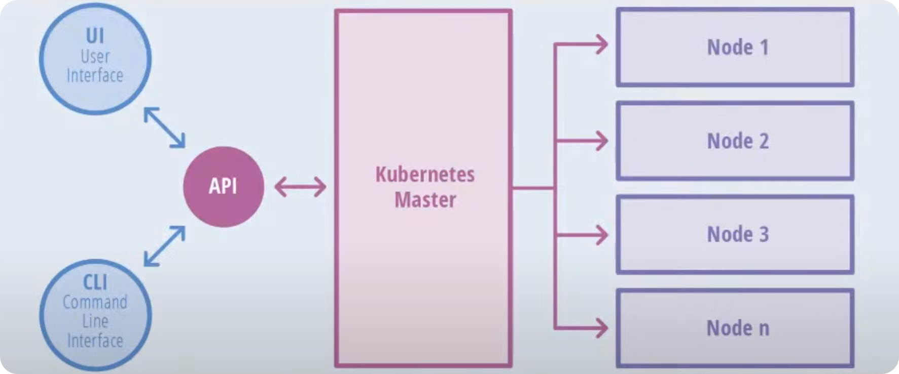

Kubernetes นั้นประกอบด้วย 2 Components หลักๆ คือ

1. Kubernetes Master (control plane)
หน้าที่หลักๆ คือ คอยควบคุมและดูแล Kubernetes node ต่างๆ เช่น คอย check ว่ามีตัวไหนพังหรือเปล่าหรือต้องการย้าย Container นี้ไปรันบน เครื่องอื่นหรือเปล่า โดยที่ตัว Kubernetes master นั้นไม่สามารถรัน Container ต่างๆ ได้ การสั่งงานจะ Kubernetes Master นั้นต้องสั่งผ่าน API เท่านั้น โดยสามารถสั่งได้ผ่าน Kubernetes CLI หรือ GUI Dashboard ของ Cloud เจ้าต่างๆ 

2. Kubernetes Node (worker node) 
คือ ส่วนที่จะเป็นที่ไว้ให้ Container หรือ Service ต่างๆ รันอยู่ทำงาน โดยที่ Node เหล่านี้จะถูกควบคุมด้วย Kubernetes Master (control plane) อีกที 

##### Kubernetes Detail Architecture

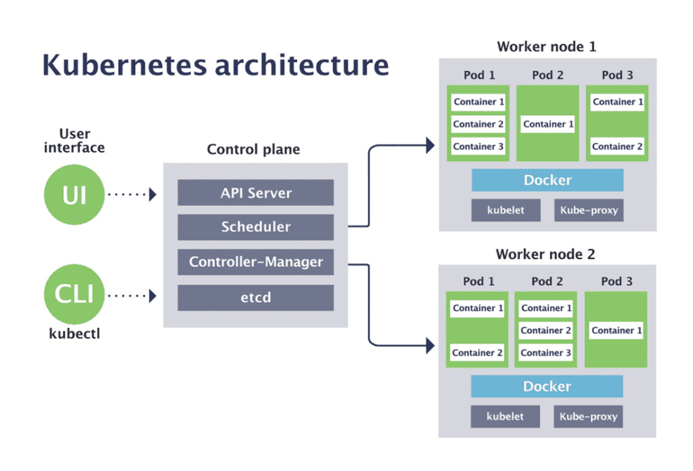

##### Kubernetes Cluster

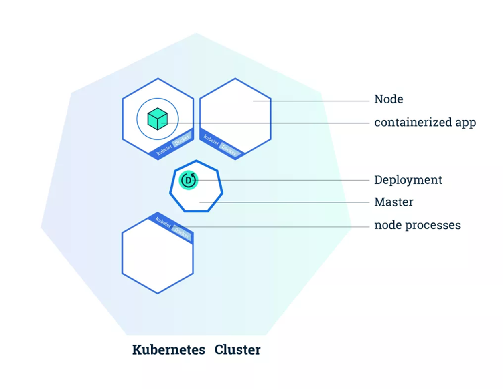

##### Orchestration Technologies

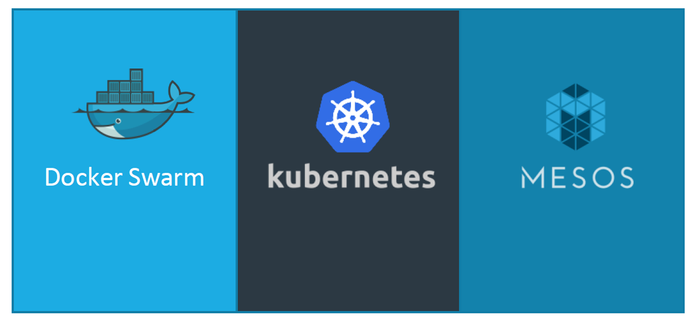

##### Setup Kubernetes

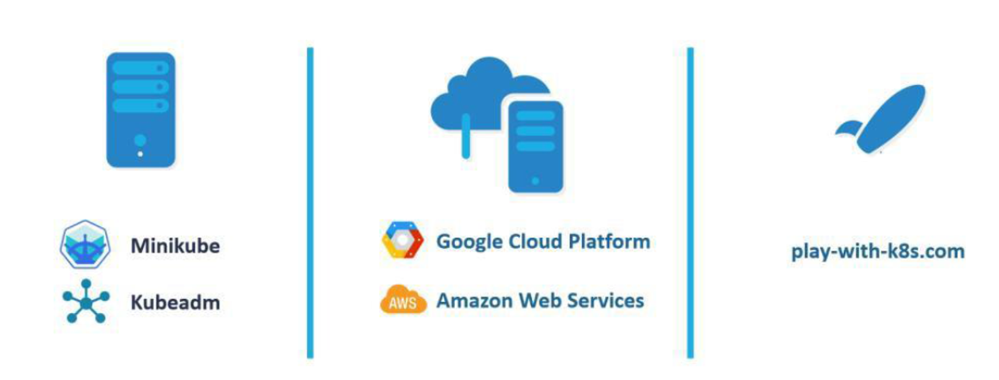

##### Single node Cluster with Docker Desktop or Minikube

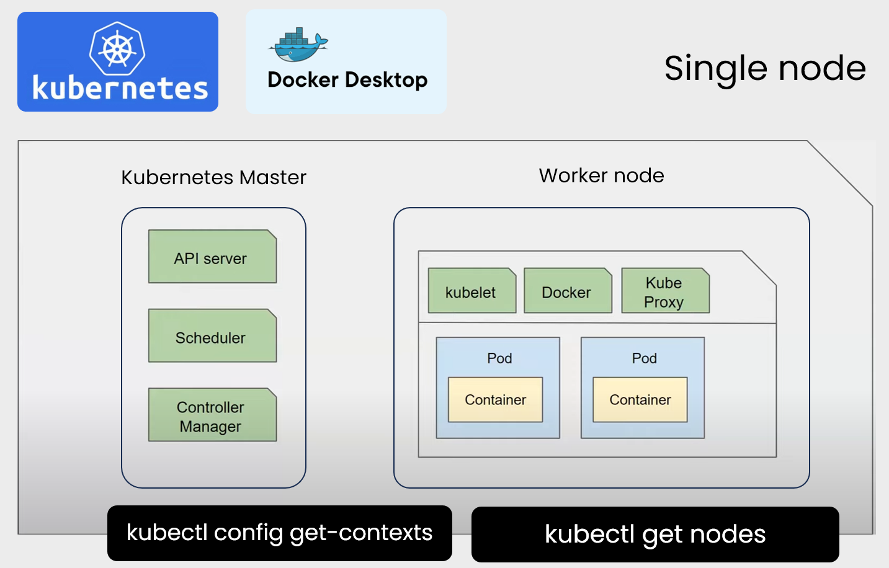

##### Multiple node Cluster with Kind in Docker Desktop

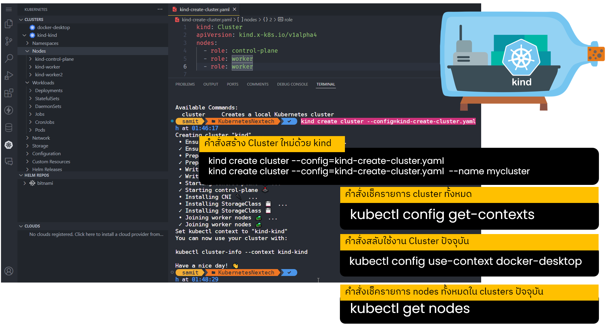

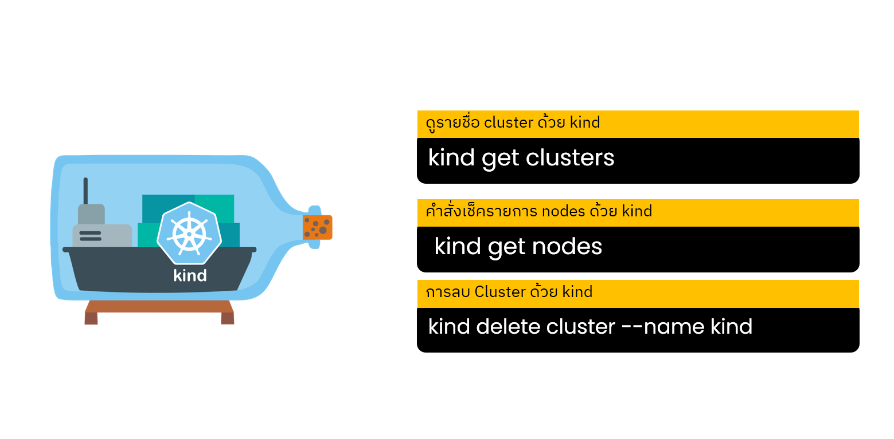

##### แนะนำ Tools จัดการ Kubernetes Cluster สำหรับนักพัฒนา

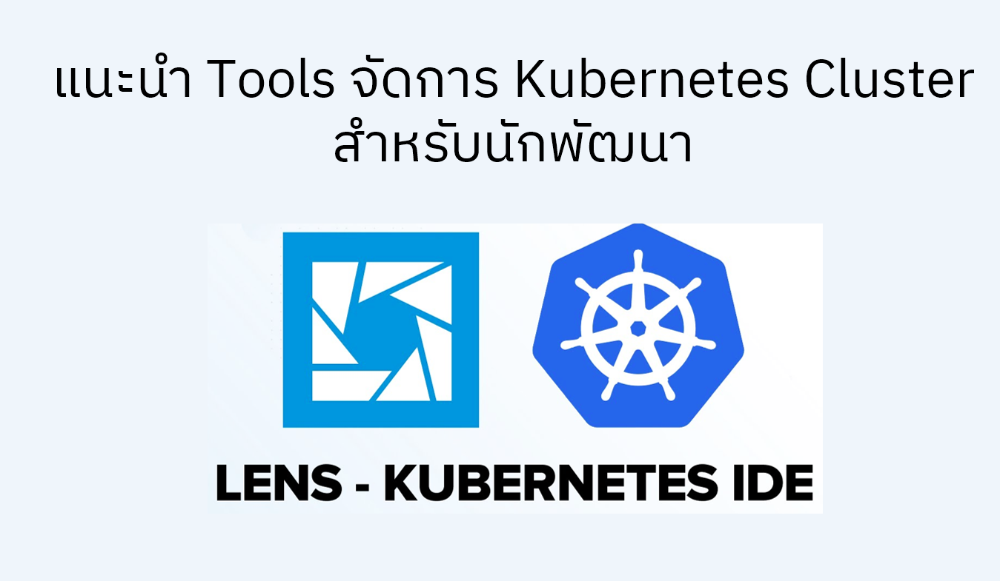

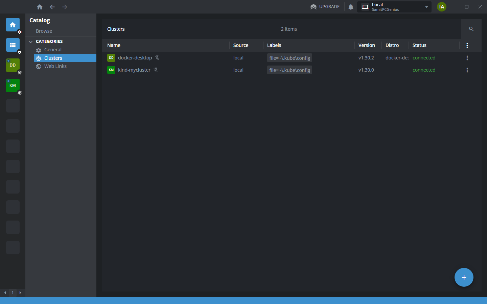

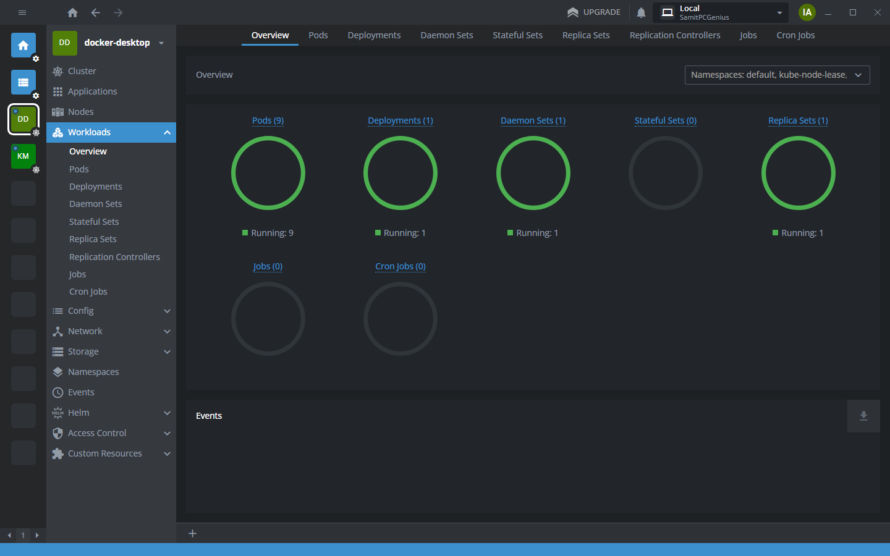

### ⚡ Day 3

- [x] Section 4: พื้นฐานและภาพรวม Kubernetes (ต่อ)
- [x] Section 5: การสร้าง Pod และ Deployment
- [x] Section 6: การสร้างและใช้งาน Services

##### เก็บตกเนื้อหาของวันที่ 2

อัพเดทเรื่อง Docker กับ Database ทั้ง 7 ประกอบด้วย

- PostgreSQL
- MySQL
- MariaDB
- SQLServer
- Oracle
- MongoDB
- SQLite

Clone Project ตัวอย่างได้ที่
📥 [7DBDocker](https://github.com/iamsamitdev/7DBDcoker)

docker-compose.yml
```yaml
networks:
  app_network:
    name: app_network
    driver: bridge

services:
  # PostgresSQL Service
  postgres:
    image: postgres:latest
    container_name: postgres_db
    environment:
      POSTGRES_USER: myuser
      POSTGRES_PASSWORD: 123456
      POSTGRES_DB: storedb
    ports:
      - "6432:5432"
    volumes:
      - ./volumes/postgres:/var/lib/postgresql/data # Mount volume
      - ./sql/init_postgresql.sql:/docker-entrypoint-initdb.d/init.sql # init script
    networks:
      - app_network
    restart: always
  
  # MySQL Service
  mysql:
    image: mysql:latest
    container_name: mysql_db
    environment:
      MYSQL_ROOT_PASSWORD: 123456
      MYSQL_DATABASE: storedb
      MYSQL_USER: myuser
      MYSQL_PASSWORD: 123456
    ports:
      - "5506:3306"
    volumes:
      - ./volumes/mysql:/var/lib/mysql  # Mount volume สำหรับ MySQL
      - ./sql/init_mysql.sql:/docker-entrypoint-initdb.d/init.sql
    networks:
      - app_network
    restart: always

  # MariaDB Service
  mariadb:
    image: mariadb:latest
    container_name: mariadb_db
    environment:
      MYSQL_ROOT_PASSWORD: 123456
      MYSQL_DATABASE: storedb
      MYSQL_USER: myuser
      MYSQL_PASSWORD: 123456
    ports:
      - "6607:3306"
    volumes:
      - ./volumes/mariadb:/var/lib/mysql  # Mount volume สำหรับ MariaDB
      - ./sql/init_mariadb.sql:/docker-entrypoint-initdb.d/init.sql
    networks:
      - app_network
    restart: always
  
  # SQL Server Service (Azure SQL Edge)
  mssql:
    image: mcr.microsoft.com/azure-sql-edge:latest
    container_name: mssql_db
    environment:
      ACCEPT_EULA: Y
      MSSQL_SA_PASSWORD: "MyPassword@123"
      MSSQL_DATABASE: storedb
    ports:
      - "1533:1433"
    volumes:
      - ./volumes/mssql:/var/opt/mssql  # Mount volume สำหรับ SQL Server
      - ./sql/init_sqlserver.sql:/var/opt/mssql/init.sql  # Mount SQL init file
    networks:
      - app_network
    restart: always
  
  # Oracle Service
  oracle:
    image: gvenzl/oracle-free:latest
    container_name: oracle_db
    environment:
      - ORACLE_PASSWORD=MyPassword@123
      - APP_USER=my_user
      - APP_USER_PASSWORD=MyPassword@123
      - ORACLE_SID=FREE
      - ORACLE_DATABASE=storedb
      - ORACLE_LISTENER_PORT=1521
    ports:
      - "1621:1521"
    volumes:
      - ./volumes/oracle:/opt/oracle/oradata  # Mount volume สำหรับ Oracle
      - ./sql/init_oracle.sql:/docker-entrypoint-initdb.d/init.sql
    restart: always
    networks:
    - app_network

  # MongoDB Service
  mongo:
    image: mongo:latest
    container_name: mongo_db
    environment:
      MONGO_INITDB_ROOT_USERNAME: myuser
      MONGO_INITDB_ROOT_PASSWORD: 123456
      MONGO_INITDB_DATABASE: storedb
    ports:
      - "37017:27017"
    volumes:
      - ./volumes/mongodb:/data/db  # Mount volume สำหรับ MongoDB
      - ./sql/init_mongodb.js:/docker-entrypoint-initdb.d/init.js  # Use JS script for init
    networks:
      - app_network
    restart: always

  # SQLite Service
  sqlite:
    platform: linux/arm64  # เปลี่ยนเป็น ARM สำหรับ macOS M1
    image: keinos/sqlite3:latest  # ใช้ image ที่รองรับ ARM
    container_name: sqlite_db
    environment:
      DB_PATH: /data/storedb.db
    volumes:
      - ./data:/data  # Mount volume สำหรับ SQLite
      - ./sql:/docker-entrypoint-initdb.d  # Mount ไฟล์ SQL ที่จะใช้ init
    command: sh -c "sqlite3 /data/storedb.db < /docker-entrypoint-initdb.d/init_sqlite.sql && tail -f /dev/null"  # รันไฟล์ SQL แล้วให้ container ทำงานต่อ
    networks:
      - app_network
    restart: always
```

##### ตัวอย่าง MERN Stack ด้วย Docker Compose

Clone Project ตัวอย่างได้ที่
📥 [mernstack](https://github.com/iamsamitdev/mernstack)

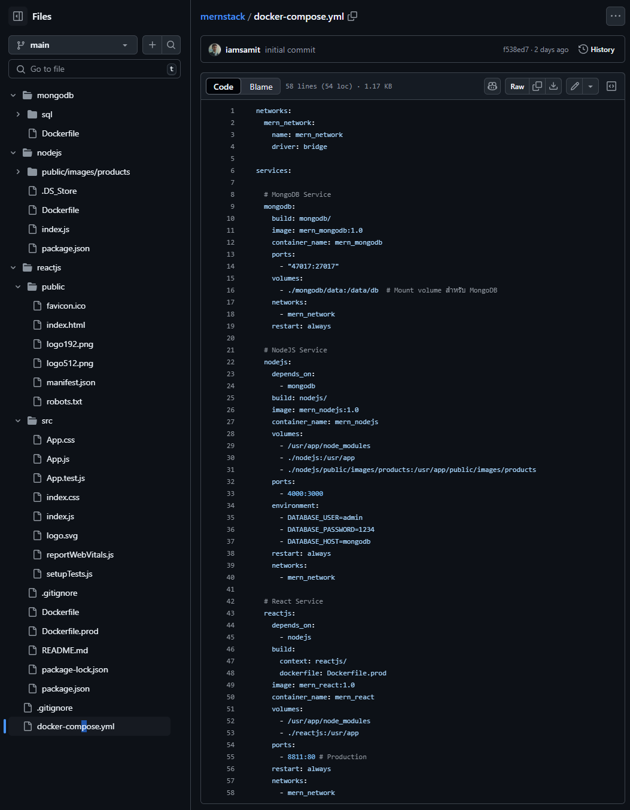

docker-compose.yml
```yaml
networks:
  mern_network:
    name: mern_network
    driver: bridge

services:

  # MongoDB Service
  mongodb:
    build: mongodb/
    image: mern_mongodb:1.0
    container_name: mern_mongodb
    ports:
      - "47017:27017"
    volumes:
      - ./mongodb/data:/data/db  # Mount volume สำหรับ MongoDB
    networks:
      - mern_network
    restart: always
  
  # NodeJS Service
  nodejs:
    depends_on:
      - mongodb
    build: nodejs/
    image: mern_nodejs:1.0
    container_name: mern_nodejs
    volumes:
      - /usr/app/node_modules
      - ./nodejs:/usr/app
      - ./nodejs/public/images/products:/usr/app/public/images/products
    ports:
      - 4000:3000
    environment:
      - DATABASE_USER=admin
      - DATABASE_PASSWORD=1234
      - DATABASE_HOST=mongodb
    restart: always
    networks:
      - mern_network

  # React Service
  reactjs:
    depends_on:
      - nodejs
    build: 
      context: reactjs/
      dockerfile: Dockerfile.prod
    image: mern_react:1.0
    container_name: mern_react
    volumes:
      - /usr/app/node_modules
      - ./reactjs:/usr/app
    ports:
      - 8811:80 # Production
    restart: always
    networks:
      - mern_network
```

#### พื้นฐานและภาพรวม Kubernetes

<ul>
  <li>Kubernetes Overview</li>
  <li>Kubernetes architecture</li>
  <li>Pod</li>
  <li>Deployment</li>
  <li>Services</li>
  <li>Namespace</li>
  <li>ReplicaSet</li>
</ul>
